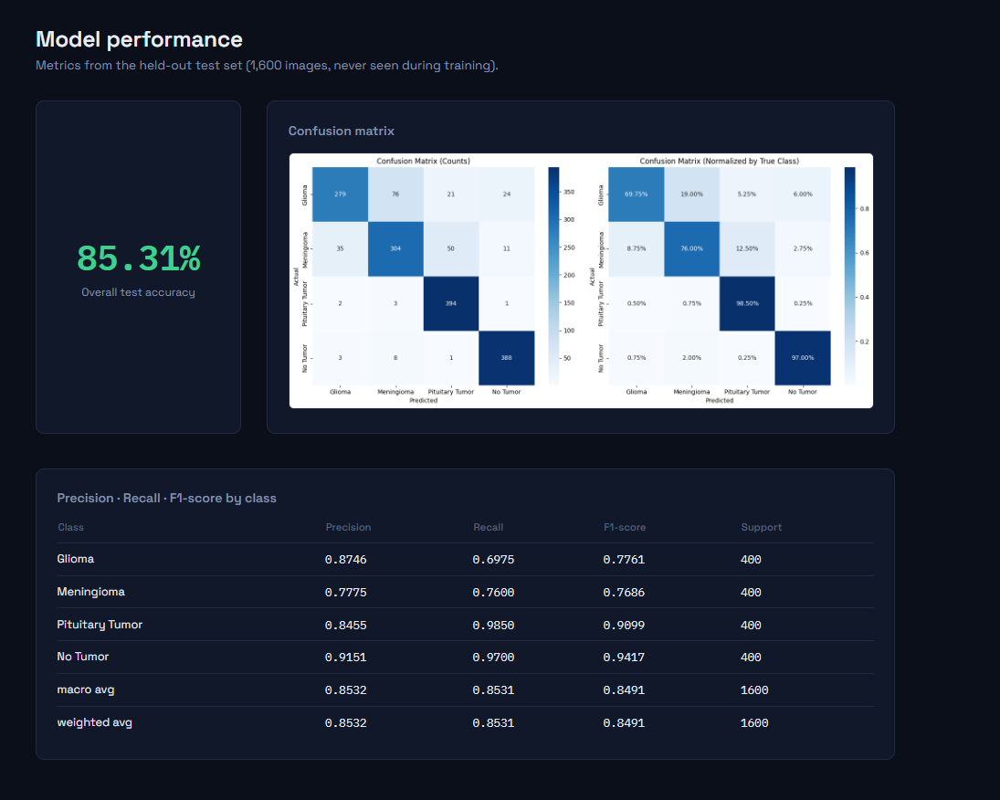
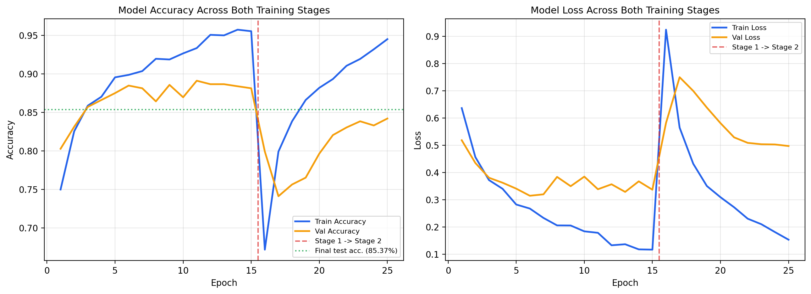

# 🧠 Cortex — Brain Tumor MRI Classifier

[](https://www.python.org/)
[](https://www.tensorflow.org/)
[](https://flask.palletsprojects.com/)
[](#model-performance)
[](#license)
# 🧠 Cortex — Brain Tumor MRI Classifier

[](https://www.python.org/)
[](https://www.tensorflow.org/)
[](https://flask.palletsprojects.com/)
[](#model-performance)
[](#license)

A locally-hosted diagnostic dashboard that classifies brain MRI scans into
**Glioma**, **Meningioma**, **Pituitary Tumor**, or **No Tumor** using
transfer learning on EfficientNetB0. Built end-to-end: dataset pipeline,
two-stage training, full evaluation, and a custom clinical-console web UI
— no cloud dependency, runs entirely on your own machine.

> ⚠️ **Educational/demonstration project only.** This is not a certified
> medical device and must never be used for actual clinical diagnosis.

---

## Screenshot



---

## Model Performance

Evaluated on a held-out test set of 1,600 MRI images (never seen during
training):

| Class | Precision | Recall | F1-score | Support |
|---|---|---|---|---|
| Glioma | 0.8746 | 0.6975 | 0.7761 | 400 |
| Meningioma | 0.7775 | 0.7600 | 0.7686 | 400 |
| Pituitary Tumor | 0.8455 | 0.9850 | 0.9099 | 400 |
| No Tumor | 0.9151 | 0.9700 | 0.9417 | 400 |
| **Overall accuracy** | | | **85.31%** | 1600 |

**Architecture:** EfficientNetB0 (ImageNet pretrained) → GlobalAveragePooling2D
→ Dense(256, ReLU) → Dropout(0.3) → Dense(128, ReLU) → Dropout(0.2) →
Dense(4, Softmax)

**Training:** Two-stage transfer learning — Stage 1 trains only the
classification head with the base frozen (89.11% peak validation accuracy);
Stage 2 attempted full fine-tuning of the base model, which underperformed
Stage 1 due to overfitting on a relatively small dataset (5,600 training
images), so the Stage 1 weights were kept as the final model.

## Features

- 🔍 **Predict** — drag-and-drop MRI upload with instant per-class confidence breakdown
- 📜 **Recent History** — every prediction is logged locally (image + result), persists across app restarts
- 📊 **Model Performance** — confusion matrix and full precision/recall/F1 breakdown, always visible
- 🖥️ **Fully local** — no cloud API calls, no internet dependency once installed, runs on `localhost`

## Tech Stack

- **Model:** TensorFlow / Keras, EfficientNetB0 transfer learning
- **Backend:** Flask
- **Frontend:** Vanilla HTML/CSS/JS (custom-designed clinical console UI)
- **Data:** [Brain Tumor MRI Dataset](https://www.kaggle.com/datasets/masoudnickparvar/brain-tumor-mri-dataset) (Kaggle), 7,200 images across 4 classes

## Getting Started

### Prerequisites

- Python **3.11 or 3.12** (TensorFlow does not yet support 3.13+)
- ~2GB free disk space (for dependencies)

### Installation

```bash
git clone https://github.com/pasupathy188/cortex-brain-tumor-classifier.git
cd cortex-brain-tumor-classifier

python -m venv venv
venv\Scripts\activate        # Windows
# source venv/bin/activate   # macOS/Linux

pip install -r requirements.txt
```
A locally-hosted diagnostic dashboard that classifies brain MRI scans into
**Glioma**, **Meningioma**, **Pituitary Tumor**, or **No Tumor** using
transfer learning on EfficientNetB0. Built end-to-end: dataset pipeline,
two-stage training, full evaluation, and a custom clinical-console web UI
— no cloud dependency, runs entirely on your own machine.

> ⚠️ **Educational/demonstration project only.** This is not a certified
> medical device and must never be used for actual clinical diagnosis.

---

## Screenshot


---

## Model Performance

Evaluated on a held-out test set of 1,600 MRI images (never seen during
training):

| Class | Precision | Recall | F1-score | Support |
|---|---|---|---|---|
| Glioma | 0.8746 | 0.6975 | 0.7761 | 400 |
| Meningioma | 0.7775 | 0.7600 | 0.7686 | 400 |
| Pituitary Tumor | 0.8455 | 0.9850 | 0.9099 | 400 |
| No Tumor | 0.9151 | 0.9700 | 0.9417 | 400 |
| **Overall accuracy** | | | **85.31%** | 1600 |

**Architecture:** EfficientNetB0 (ImageNet pretrained) → GlobalAveragePooling2D
→ Dense(256, ReLU) → Dropout(0.3) → Dense(128, ReLU) → Dropout(0.2) →
Dense(4, Softmax)

**Training:** Two-stage transfer learning — Stage 1 trains only the
classification head with the base frozen (89.11% peak validation accuracy);
Stage 2 attempted full fine-tuning of the base model, which underperformed
Stage 1 due to overfitting on a relatively small dataset (5,600 training
images), so the Stage 1 weights were kept as the final model.



<details>
<summary><strong>Full training log (all 25 epochs, click to expand)</strong></summary>

```
============================================================
STAGE 1: Training Classification Head (Base Frozen)
============================================================
Epoch 1/15  - accuracy: 0.7498 - loss: 0.6369 - val_accuracy: 0.8027 - val_loss: 0.5189
Epoch 2/15  - accuracy: 0.8254 - loss: 0.4570 - val_accuracy: 0.8313 - val_loss: 0.4354
Epoch 3/15  - accuracy: 0.8587 - loss: 0.3726 - val_accuracy: 0.8571 - val_loss: 0.3812
Epoch 4/15  - accuracy: 0.8703 - loss: 0.3406 - val_accuracy: 0.8661 - val_loss: 0.3629
Epoch 5/15  - accuracy: 0.8955 - loss: 0.2829 - val_accuracy: 0.8750 - val_loss: 0.3412
Epoch 6/15  - accuracy: 0.8987 - loss: 0.2681 - val_accuracy: 0.8848 - val_loss: 0.3151
Epoch 7/15  - accuracy: 0.9036 - loss: 0.2337 - val_accuracy: 0.8813 - val_loss: 0.3203
Epoch 8/15  - accuracy: 0.9196 - loss: 0.2062 - val_accuracy: 0.8643 - val_loss: 0.3843
Epoch 9/15  - accuracy: 0.9187 - loss: 0.2058 - val_accuracy: 0.8857 - val_loss: 0.3502
Epoch 10/15 - accuracy: 0.9266 - loss: 0.1844 - val_accuracy: 0.8696 - val_loss: 0.3853
Epoch 11/15 - accuracy: 0.9335 - loss: 0.1790 - val_accuracy: 0.8911 - val_loss: 0.3390  <- best epoch
Epoch 12/15 - accuracy: 0.9507 - loss: 0.1332 - val_accuracy: 0.8866 - val_loss: 0.3572
Epoch 13/15 - accuracy: 0.9500 - loss: 0.1370 - val_accuracy: 0.8866 - val_loss: 0.3292
Epoch 14/15 - accuracy: 0.9574 - loss: 0.1182 - val_accuracy: 0.8839 - val_loss: 0.3680
Epoch 15/15 - accuracy: 0.9554 - loss: 0.1172 - val_accuracy: 0.8813 - val_loss: 0.3373
Restoring model weights from the end of the best epoch: 6.

============================================================
STAGE 2: Fine-tuning Entire Model (Base Unfrozen)
============================================================
Epoch 1/10  - accuracy: 0.6717 - loss: 0.9249 - val_accuracy: 0.7991 - val_loss: 0.5823
Epoch 2/10  - accuracy: 0.7991 - loss: 0.5652 - val_accuracy: 0.7411 - val_loss: 0.7503
Epoch 3/10  - accuracy: 0.8384 - loss: 0.4325 - val_accuracy: 0.7563 - val_loss: 0.7000
Epoch 4/10  - accuracy: 0.8661 - loss: 0.3508 - val_accuracy: 0.7652 - val_loss: 0.6388
Epoch 5/10  - accuracy: 0.8819 - loss: 0.3097 - val_accuracy: 0.7964 - val_loss: 0.5817
Epoch 6/10  - accuracy: 0.8933 - loss: 0.2728 - val_accuracy: 0.8205 - val_loss: 0.5295
Epoch 7/10  - accuracy: 0.9105 - loss: 0.2308 - val_accuracy: 0.8304 - val_loss: 0.5093
Epoch 8/10  - accuracy: 0.9194 - loss: 0.2106 - val_accuracy: 0.8384 - val_loss: 0.5042
Epoch 9/10  - accuracy: 0.9319 - loss: 0.1817 - val_accuracy: 0.8330 - val_loss: 0.5034
Epoch 10/10 - accuracy: 0.9451 - loss: 0.1537 - val_accuracy: 0.8420 - val_loss: 0.4977  <- best epoch
Restoring model weights from the end of the best epoch: 10.
```

</details>

## Features

- 🔍 **Predict** — drag-and-drop MRI upload with instant per-class confidence breakdown
- 📜 **Recent History** — every prediction is logged locally (image + result), persists across app restarts
- 📊 **Model Performance** — confusion matrix and full precision/recall/F1 breakdown, always visible
- 🖥️ **Fully local** — no cloud API calls, no internet dependency once installed, runs on `localhost`

## Tech Stack

- **Model:** TensorFlow / Keras, EfficientNetB0 transfer learning
- **Backend:** Flask
- **Frontend:** Vanilla HTML/CSS/JS (custom-designed clinical console UI)
- **Data:** [Brain Tumor MRI Dataset](https://www.kaggle.com/datasets/masoudnickparvar/brain-tumor-mri-dataset) (Kaggle), 7,200 images across 4 classes

## Getting Started

### Prerequisites

- Python **3.11 or 3.12** (TensorFlow does not yet support 3.13+)
- ~2GB free disk space (for dependencies)

### Installation

```bash
git clone https://github.com/pasupathy188/cortex-brain-tumor-classifier.git
cd cortex-brain-tumor-classifier

python -m venv venv
venv\Scripts\activate        # Windows
# source venv/bin/activate   # macOS/Linux

pip install -r requirements.txt
```

### Run

```bash
### Run

```bash
python app.py
```

Open **http://localhost:5000** in your browser.
Open **http://localhost:5000** in your browser.

## Project Structure

```
cortex-brain-tumor-classifier/
├── app.py                        # Flask backend + inference API
├── best_model_final.keras        # Trained model (85.31% test accuracy)
├── classification_report.json    # Precision/recall/F1 per class
## Project Structure

```
cortex-brain-tumor-classifier/
├── app.py                        # Flask backend + inference API
├── best_model_final.keras        # Trained model (85.31% test accuracy)
├── classification_report.json    # Precision/recall/F1 per class
├── requirements.txt
├── templates/
│   └── index.html                # Dashboard shell
│   └── index.html                # Dashboard shell
└── static/
    ├── css/style.css             # Clinical console styling
    ├── js/script.js               # Frontend logic
    ├── confusion_matrix_final.png
    └── history_images/            # Saved scan thumbnails (generated at runtime)
```

## How It Was Built

1. **Data pipeline** — `tf.keras.utils.image_dataset_from_directory` with
   stratified train/validation split, on-the-fly augmentation (flip,
   rotation, zoom, translation)
2. **Transfer learning** — EfficientNetB0 base frozen initially, custom
   classification head trained first (Stage 1), then selectively evaluated
   against a full fine-tune (Stage 2) — Stage 1 won on held-out test accuracy
3. **Evaluation** — confusion matrix, per-class precision/recall/F1 via
   scikit-learn, generalization spot-checked against out-of-distribution
   sample images
4. **Deployment** — packaged as a local Flask app with a purpose-built
   dashboard UI, replacing an earlier Gradio prototype for a more polished,
   offline-capable result

## Known Limitations

- Trained on a single public dataset; accuracy on scans from different
  scanners/institutions/preprocessing pipelines may vary (see [Known
  Limitations](#known-limitations) testing notes below)
- Glioma and Meningioma are the most visually similar classes and show the
  lowest recall (69.75% and 76.00% respectively) — the model most often
  confuses these two with each other
- No rejection/"not a brain MRI" class — the model will still output one of
  the four classes even for unrelated input images

## License

Educational/academic use. Not for clinical or commercial deployment.
    ├── css/style.css             # Clinical console styling
    ├── js/script.js               # Frontend logic
    ├── confusion_matrix_final.png
    └── history_images/            # Saved scan thumbnails (generated at runtime)
```

## How It Was Built

1. **Data pipeline** — `tf.keras.utils.image_dataset_from_directory` with
   stratified train/validation split, on-the-fly augmentation (flip,
   rotation, zoom, translation)
2. **Transfer learning** — EfficientNetB0 base frozen initially, custom
   classification head trained first (Stage 1), then selectively evaluated
   against a full fine-tune (Stage 2) — Stage 1 won on held-out test accuracy
3. **Evaluation** — confusion matrix, per-class precision/recall/F1 via
   scikit-learn, generalization spot-checked against out-of-distribution
   sample images
4. **Deployment** — packaged as a local Flask app with a purpose-built
   dashboard UI, replacing an earlier Gradio prototype for a more polished,
   offline-capable result

## Known Limitations

- Trained on a single public dataset; accuracy on scans from different
  scanners/institutions/preprocessing pipelines may vary (see [Known
  Limitations](#known-limitations) testing notes below)
- Glioma and Meningioma are the most visually similar classes and show the
  lowest recall (69.75% and 76.00% respectively) — the model most often
  confuses these two with each other
- No rejection/"not a brain MRI" class — the model will still output one of
  the four classes even for unrelated input images

## License

Educational/academic use. Not for clinical or commercial deployment.
